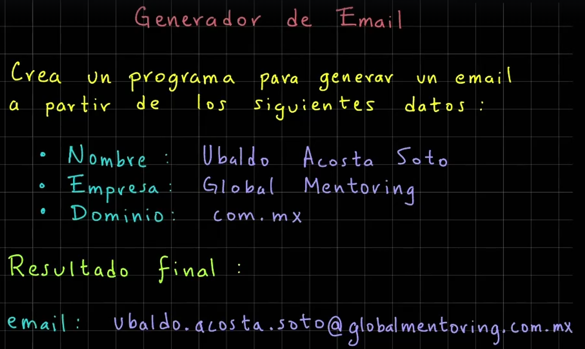
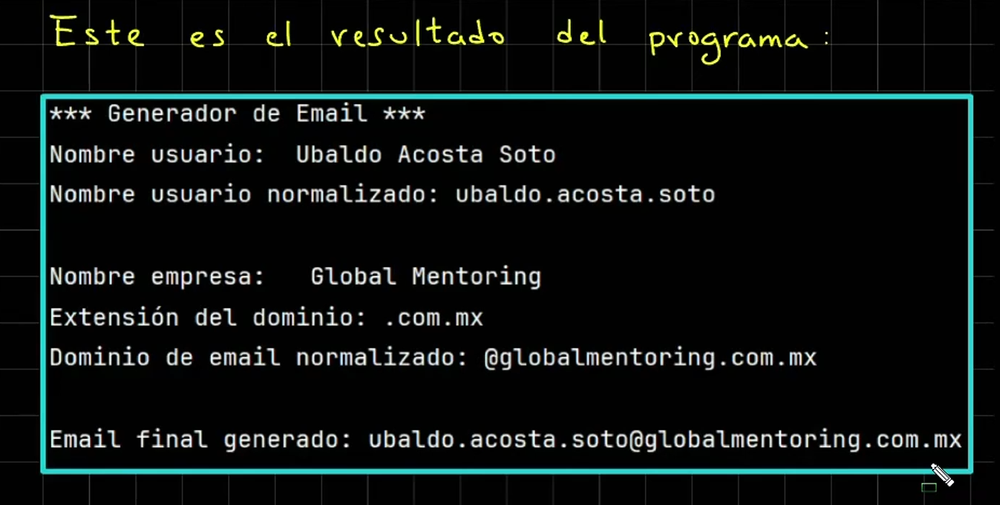

# Curso de Java

Sintaxis para mostrar un hola mundo en JAVA

```java
public class HolaMundo {
    //Agregamos el metodo principal
    public static void main(String[] args) {
        System.out.println("hola mundo perros");
    }
}
```
#### Ejercicio presentarse en java

```java
public class Presentate {
    public static void main(String[] args) {
        System.out.println("Angel G");
        System.out.println("27 años");
        System.out.println("mexico");
    }
}

```
***

## Variables

#### Ejercicio de reserva de hoteles

```java
import java.sql.SQLOutput;

public class ReservaHoteles {
    public static void main(String[] args) {
        /*
        Sistema de reserva de Hoteles

        Captura el detalle de la reservacion de hoteles.

        El detalle que se debe de capturar es:
        - Nombre del cliente
        - Dias de estancia
        - Tarifa diaria
        - Indicar si la habitacion cuenta con vista al mar

        Debe asignar valores iniciales y mandar a imprimir el valor de cada variable.
        Por ultimo se les pide modificar algunos valores de la reservacion y mandar a imprimr nuevamente cada
        variable para observar los cambios
        * */

        System.out.println("*** Reserva de hoteles ***");

        //Definimos variables
        var nombreCliente="Miguel flores";
        var diasEstancia=7;
        var tarifaDiaria=1300;
        var tienesVistaMar=true;

        //Mostramos el detalle de la reserva con soutv (con esto imprimimos las variables)
        System.out.println("nombreCliente = " + nombreCliente);
        System.out.println("diasEstancia = " + diasEstancia);
        System.out.println("tarifaDiaria = " + tarifaDiaria);
        System.out.println("tienesVistaMar = " + tienesVistaMar);

        //Modificando valores
        diasEstancia=4;
        tarifaDiaria=1111;
        tienesVistaMar=false;

        //Nuevos datos de la reservacion
        System.out.println("Nuevos datos de la reservacion");
        System.out.println("nombreCliente = " + nombreCliente);
        System.out.println("diasEstancia = " + diasEstancia);
        System.out.println("tarifaDiaria = " + tarifaDiaria);
        System.out.println("tienesVistaMar = " + tienesVistaMar);
    }
}
```

***
## Cadenas

Manejo de cadenas en JAVA
```java
public class Cadenas {
    public static void main(String[] args) {
        System.out.println("*** Manejo de Cadenas en Java ***");
        var cadena1 = "Hola";
        System.out.println("cadena1 = " + cadena1);
        var cadena2 = new String("Mundo");
        System.out.println("cadena2 = " + cadena2);
        var cadena3 = cadena1 + " " + cadena2;
        System.out.println("cadena3 = " + cadena3);
        // Cadena multiples lineas (text block)       
        var cadena4 = """
                Este es un texto
                multilinea
                mas 
                lineas
                """;
        System.out.println("cadena4 = " + cadena4);
    }
}
```

#### Ejemplo de comparacion de cadenas

```java
public class ComparacionCadenas {
    public static void main(String[] args) {
        // Comparacion de Cadenas (pool de cadenas)
        var cadena1 = "Java";
        var cadena2 = "Java";
        var cadena3 = new String("Java");

        // Comparacion de cadenas (==) comparan la referencia
        System.out.print("cadena1 es igual en referencia a cadena2: ");
        System.out.println(cadena1 == cadena2);
        // Comparamos cadena1 con cadena3 (referencias)
        System.out.print("cadena1 es igual en referencia a cadena3: ");
        System.out.println(cadena1 == cadena3);

        // Comparar contenido usaremos el metodo equals
        System.out.print("cadena1 es igual en contenido a cadena3: ");
        System.out.println(cadena1.equals(cadena3));

    }
}

```

#### Ejemplo de manejo de indices en una cadena 
```java
public class IndicesCadena {
    public static void main(String[] args) {
        // Manejo de índices en una cadena
        var cadena1 = "Hola Mundo";
        // Recuperar el primer caracter
        var primerCaracter = cadena1.charAt(0); // Recuperar el caracter 'H'
        System.out.println("primerCaracter = " + primerCaracter);
        // Recuperar el último caracter (en la posicion 9)
        var ultimoCaracter = cadena1.charAt(9);
        System.out.println("ultimoCaracter = " + ultimoCaracter);
        // imprimir la leta M, indice 5
        var letraM = cadena1.charAt(5);
        System.out.println("letraM = " + letraM);
    }
}
```
#### Inmutabilidad de cadenas

```java
public class InmutabilidadCadenas {
    public static void main(String[] args) {
        //Inmutabilidad de Cadenas
        var cadena1="hola";
        System.out.println("cadena1 = " + cadena1);
        //Si no queremos perder la referencia del objeto anterior,
        //creamos una cadena2 que almacenara la referencia de cadena1
        var cadena2=cadena1;
        cadena1="adios";
        System.out.println("cadena1 modificado = " + cadena1);
        System.out.println("cadena2 = " + cadena2);
    }
}
```

#### Metodos de cadenas
```java
public class MetodosDeCadenas {
    public static void main(String[] args) {
        // Metodo de cadenas
        var cadena1 = "Hola Mundo";

        // Obtener el largo de una cadena
        var longitud = cadena1.length();
        System.out.println("longitud = " + longitud);

        // Reemplazar caracteres
        var nuevaCadena = cadena1.replace('o','a');
        System.out.println("nuevaCadena = " + nuevaCadena);

        // Convertir a mayusculas
        var mayusculas = cadena1.toUpperCase();
        System.out.println("mayusculas = " + mayusculas);

        // Convertir a minusculas
        System.out.println("minusculas = " + cadena1.toLowerCase());

        // Eliminar espacios al inicio y al final
        var cadena2 = " Leo Reyes    ";
        System.out.println("cadena2 con espacios = " + cadena2);
        System.out.println("cadena2 sin espacios = " + cadena2.trim());

    }
}
```

### Manejo de subcadenas en JAVA

```java
public class ManejoSubcadenas {
    public static void main(String[] args) {
        // Tema de subcadenas
        // substring(inicio, fin (sin incluirlo))
        var cadena1 = "Hola Mundo";
        System.out.println("cadena1 = " + cadena1);

        // Subcadena
        var subcadena1 = cadena1.substring(0, 4);
        System.out.println("subcadena1 = " + subcadena1);

        //var subcadena2 = cadena1.substring(5);
        var subcadena2 = cadena1.substring(5, 10);
        System.out.println("subcadena2 = " + subcadena2);

    }
}
```

### Busqueda de subcadenas

```java
public class BusquedaSubcadenas {
    public static void main(String[] args) {
        // Buscar subcadenas
        // indexOf - Devuelve el indice de la primera aparicion de la subcadena
        var cadena1 = "Hola Mundo";
        // subcadena a buscar "Hola"
        var indice1 = cadena1.indexOf("Hola");
        System.out.println("indice1 = " + indice1);
        // lastIndexOf - devuelve el indice de la ultima aparicion de la subcadena
        // subcadena de Mundo
        var indice2 = cadena1.lastIndexOf("Mundo");
        System.out.println("indice2 = " + indice2);
        // subcadena no encontrada devuelve -1
        var indice3 = cadena1.lastIndexOf("Java");
        System.out.println("indice3 = " + indice3);
    }
}
```

### Reemplazar subcadenas

```java
public class ReemplazarSubcadenas {
    public static void main(String[] args) {
        // Reemplazar subcadenas
        var cadena = "Hola Mundo";
        System.out.println("cadena original = " + cadena);

        // Reemplazar "Mundo" por "a todos"
        var nuevaCadena = cadena.replace("Mundo", "a todos");
        System.out.println("nuevaCadena = " + nuevaCadena);

        // Reemplazar "Hola" por "Adios"
        nuevaCadena = cadena.replace("Hola", "Saludos");
        System.out.println("nuevaCadena = " + nuevaCadena);
    }
}

```

### Mas formas de concatenar cadenas

```java
public class MasConcatenacionCadenas {
    public static void main(String[] args) {
        //Mas formas de concatenar cadenas en java
        var cadena1="hola";
        var cadena2="mundo";
        var cadena3= cadena1 + " " + cadena2;
        System.out.println("cadena3 = " + cadena3);

        //Metodo concat
        cadena3=cadena1.concat(" ").concat("Tonotos");
        System.out.println("cadena3 usando concat = " + cadena3);

        //StringBuilder
        var constructorCadenas= new StringBuilder();
        constructorCadenas.append(cadena1);
        constructorCadenas.append(" ");
        constructorCadenas.append(cadena2);
        var resultado=constructorCadenas.toString();
        System.out.println("resultado = " + resultado);

        //StringBuffer
        var stringBuffer= new StringBuffer();
        stringBuffer.append(cadena1).append(" ").append(cadena2);
        resultado=stringBuffer.toString();
        System.out.println("resultado stringbuffer= " + resultado);

        //join
        resultado=String.join(" ", cadena1, cadena2, "tonotos");
        System.out.println("resultado join= " + resultado);
    }
}
```

### Caracteres Especiales en Java

```java
public class CaracteresEspeciales {
    public static void main(String[] args) {
        // Caracteres Especiales
        // '\n' - imprimir un salto de linea
        var cadena1 = "Hola\nMundo";
        System.out.println("cadena1 = " + cadena1);

        // '\t' - tabulador
        var cadena2 = "\tHola\tMundo";
        System.out.println("cadena2 = " + cadena2);

        // '\'' - agrega una comilla simple
        var cadena3 = "Hola \' Mundo";
        System.out.println("cadena3 = " + cadena3);

        // '\"' - agrega una comilla doble
        var cadena4 = "Hola \" Mundo";
        System.out.println("cadena4 = " + cadena4);

        // '\\' - caracter de diagonal invertida
        var cadena5 = "Hola \\ Mundo";
        System.out.println("cadena5 = " + cadena5);

    }
}
```

### Ejercicio para la creacion de emails




#### SOLUCION AL EJERCICIO

```java
public class GeneradorEmails {
    public static void main(String[] args) {
        System.out.println("*** Generador de emails ***");
        //Nombre completo del usuario
        var nombreCompleto="Angel Granados Perez";
        System.out.println("nombreCompleto = " + nombreCompleto);

        //Procesar o normalizar el nombre del usuario
        //Limpiar los espacios en blanco al inicio y al final
        var nombreNormalizado=nombreCompleto.strip();
        //Reemplazamos los espacios en blancos por puntos
        nombreNormalizado=nombreNormalizado.replace(" ",".");
        //Convertimos a minusculas el nombre
        nombreNormalizado=nombreNormalizado.toLowerCase();

        //Datos de la empresa
        var nombreEmpresa="Global Mentoriong";
        System.out.println("\nNombre empresa: "+ nombreEmpresa);
        var extensionDominio=".com.mx";

        //Quitamos los espacios en blanco y convertimos a minisculas
        var nombreEmpresaNormalizado=nombreEmpresa.strip().replace(" ",".").toLowerCase();
        var dominioEmailNormalizado="@"+ nombreEmpresaNormalizado + extensionDominio;
        System.out.println("dominioEmailNormalizado = " + dominioEmailNormalizado);
        
        //Creamos el email final
        var emailNormalizado=nombreNormalizado+dominioEmailNormalizado;
        System.out.println("emailNormalizado = " + emailNormalizado);

    }
}
```